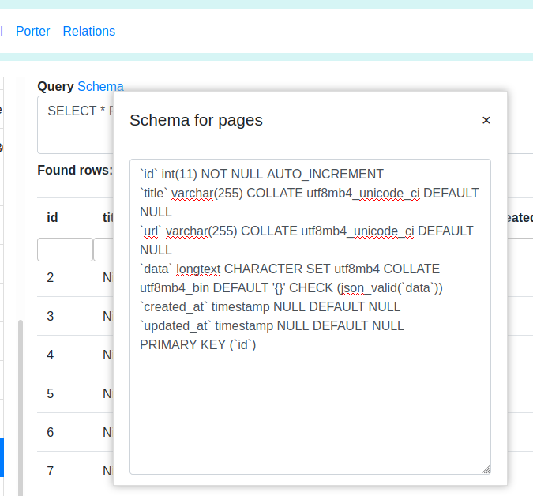

# Crude

Crude is a database table management tool, like phpMyAdmin, but different in many ways.

## How to use it
Crude has been built as a harness tool, which means that it depends on harness to 
launch a webserver and a browser tab for you, and it depends on vue-default-harness
which supplies the html layout, bootstrap, vue, and common javascript/vue and php goodness.

One these dependencies are met, you should symlink crude/bin/crude to /usr/bin so you can 
launch crude via the commandline inside a relevant working directory.

Because crude will look for a database, it is possible to run crude inside one of your
docker services. This is achieved by supplying the `--docker` option, like so:

```sh
cd /path/to/my/project;
crude . --docker
```

## Easily navigate data with filters and pagination


## Manage table structure declaratively with SimpleSchema:




## Insights into table relations:


## Cross referential exports
Sometimes you want to export a specific set of records from a table to copy them 
to another database. To be able to import this data we also need to export all associated 
records, else the receiving database will reject because of missing foreign keys.

With cross-referential export we can export a set of data and all it's associated data, 
by creating a cross-referential model of the database and using it to determine
which other records to include. 

It is something I've been looking for for years but never have been able to find. 


