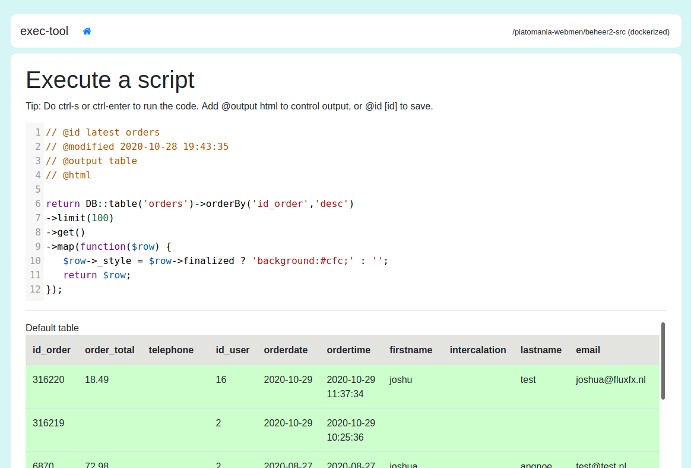

# Exec-tool

Execute code within the context of your project. For triaging problems, for testing, for fiddling
with functions, objects and stuff inside your project. For creating small project specific tools
and scripting common (developer) tasks/chores. 



The result of your script can be either data, html or table data. With HTML output it is possible
for you to create interact with the script by clicking links and submitting form data, this is one
of the ways you can create mini-applications and project-specific tools.

## Installation
Make sure you have harness installed globally
Next up, create a symlink from exec-tool/bin/exec-tool to /usr/bin/exec-tool so you can launch
exec-tool inside a directory of your project via the command line.

```sh
cd /path/to/my/project
exec-tool . [--docker=[service]]    # The docker option is optional.
```

## Bootstrapping
To be able to access all your project's library and stuff exec-tool will look for a 
`vendor/autoload.php` somewhere in one of the parent directories (relative to the directory you
launched exec-tool from). Apart from this exec-tool will also look one of the following files:
`bootstrap.php`, `bootstrap/cli.php` or `bootstrap/app.php`. The last one being laravel specific.
To bootstrap a laravel (5/6/7/8) app without handling server requests you copy-paste the following 
snippet to `bootstrap/cli.php`

```php
<?php
// Contents of bootstrap/cli.php

$app = require_once __DIR__ . '/app.php';
$app->make(Illuminate\Contracts\Console\Kernel::class)->bootstrap();
```

If your not using laravel, or have additional stuff, you can define a `bootstrap.php` and include all
your loading/configuration/app setup stuff in there.

## Docker support
If your project runs inside a docker container, (docker-compose to be more specific) you can
supply the `--docker=[serviceName]` option to exec tool.
Exec tool will be copied to some directory inside the container and harness will spin up a 
webserver running om some port. Exec-tool will run with the working directory translated to 
your local working directory inside the docker container. 


