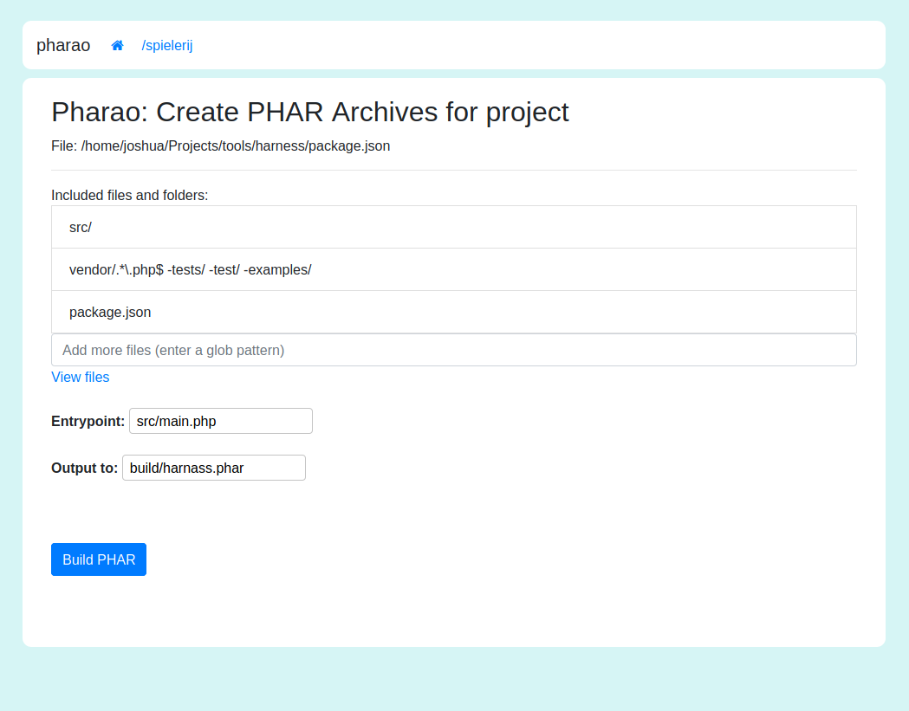
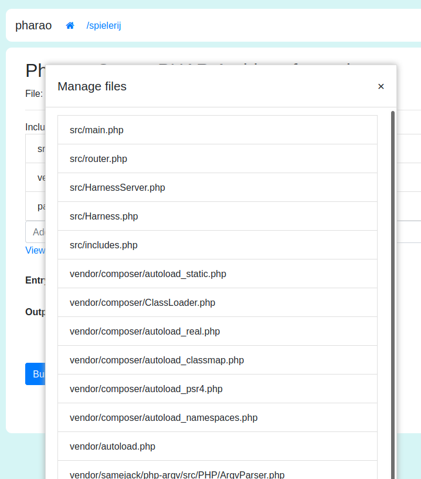

# Pharao: Build PHP Phar archives

A commandline and gui for controlling what ends up in your
phar archive:




This tool has been used to create the harness.phar.

## Install
symlink bin/pharao to /usr/bin/pharao 

## Usage
Inside your project directory run:
`pharao .` to launch the pharao gui.
The GUI will write settings to the package.json

When you've set up pharao for your project you may also run 
the following command lines:

```sh
pharao list         # List files that will be included 
pharao build        # Build the phar archive
pharao watch        # Watch the selected files and auto-rebuild when one of these changes.
```
