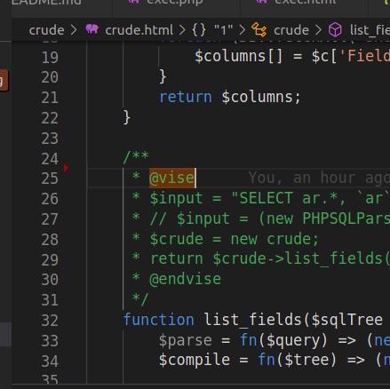
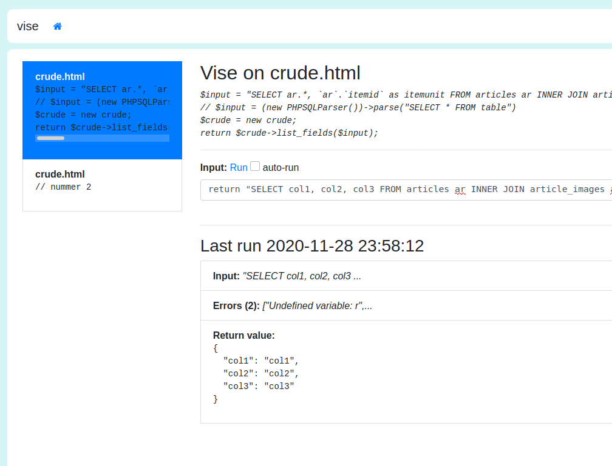

# Vise

With Vise you can clamp down a piece of (php) code, feed it input
and evaluate it's result during an intense bout of development.

## Usage 
Mark the location of your subject code with `@vise`
Start vise in your project's directory. Vise will scan the files
and your location will pop up.

## Features
- Bootstraps the subject application with the same heuristics as exec-tool
- Able to run inside a docker-context (--docker and --dockerfile)
- Displays runtime errors 
- Displays exceptions
- Allows you to manually enter input
- Automatically re-run when you return to the browser.

